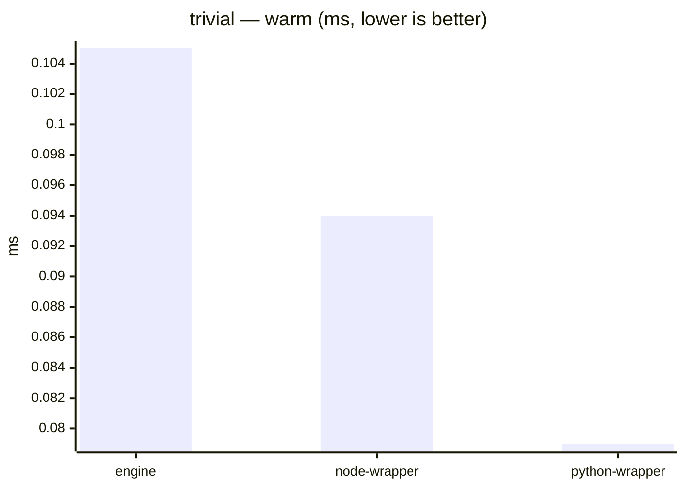
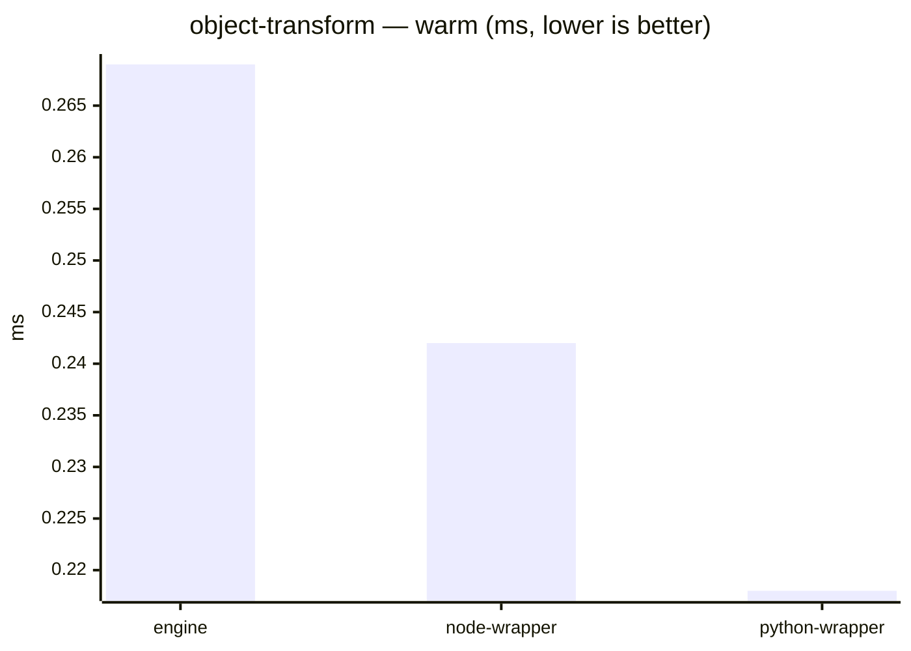
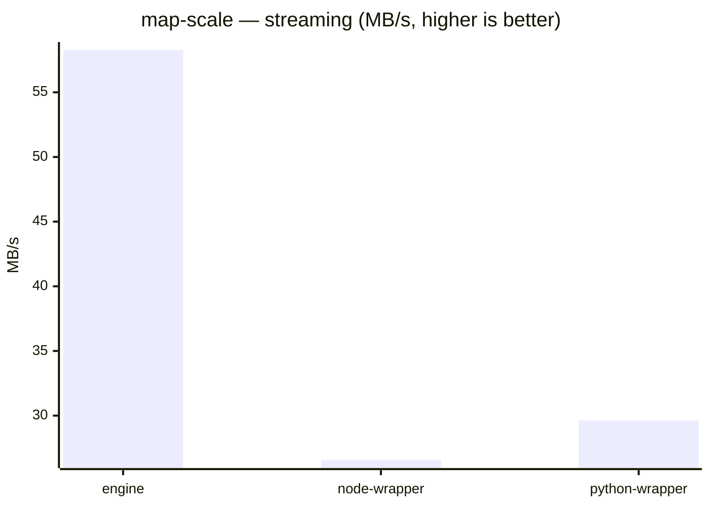
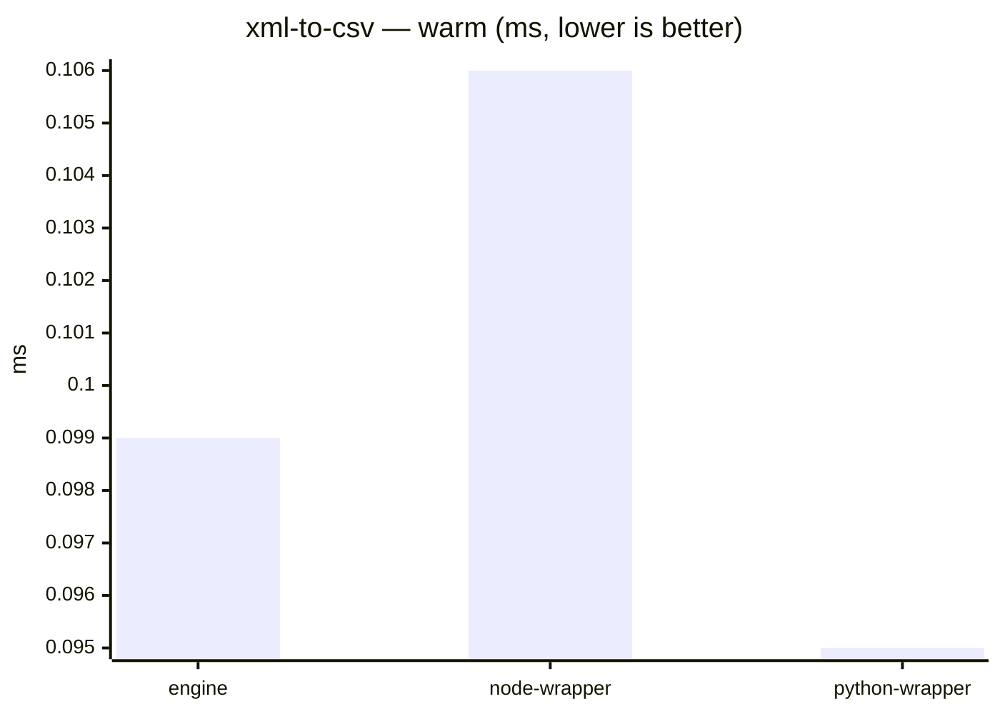
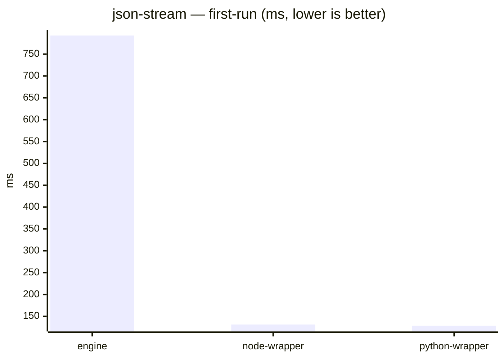
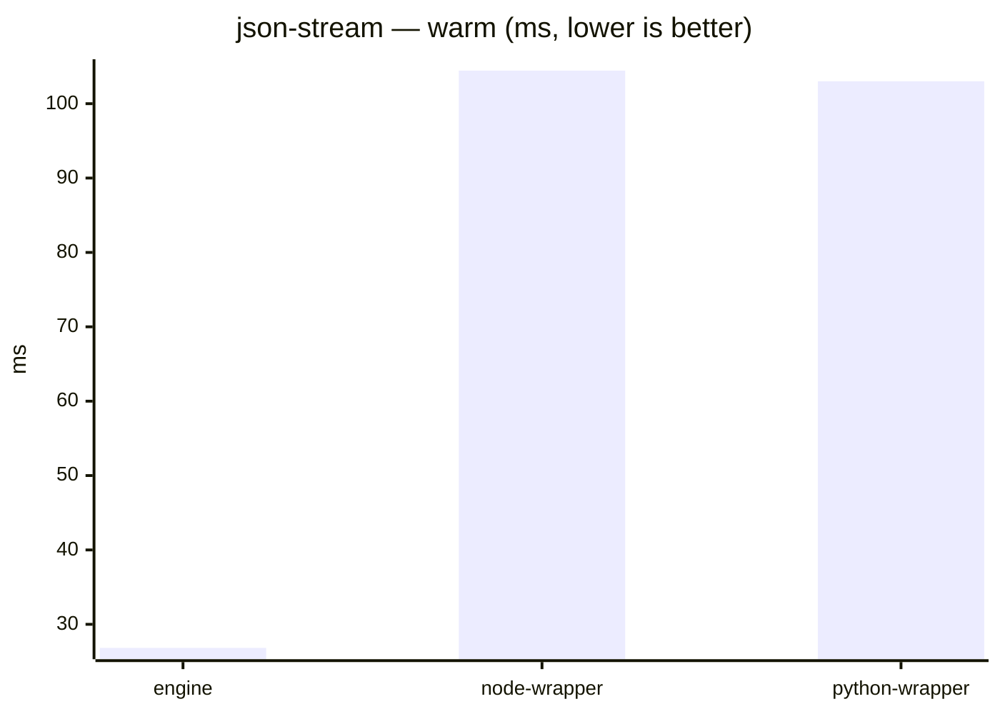
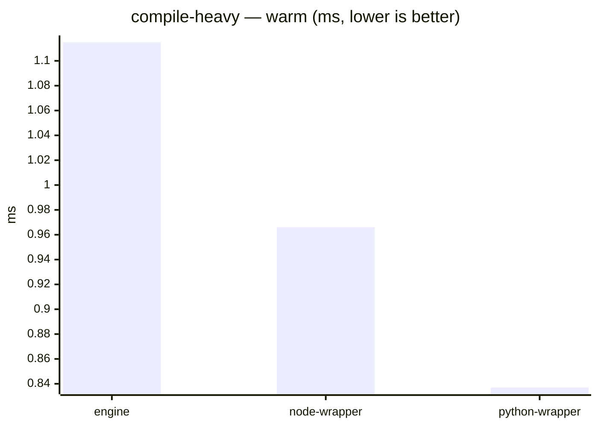
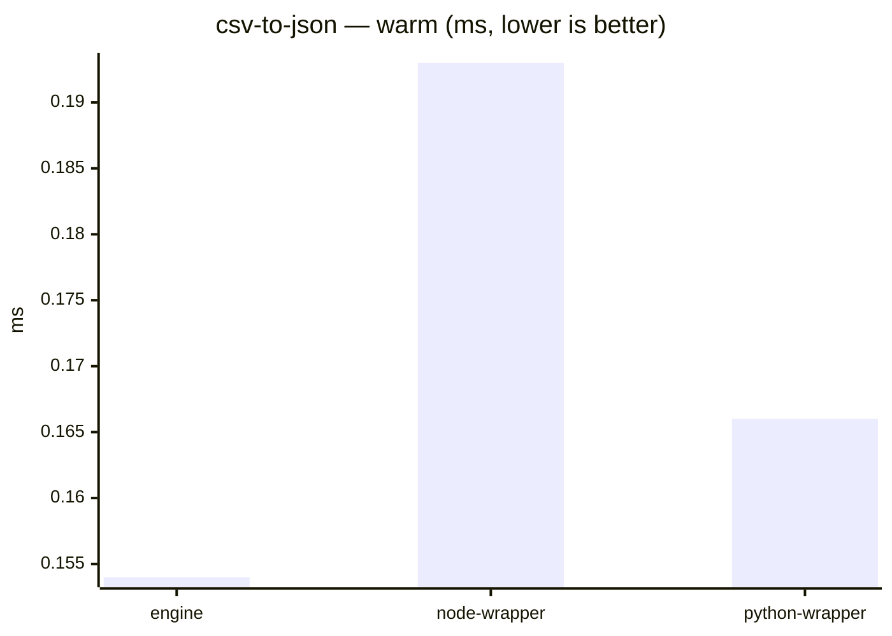
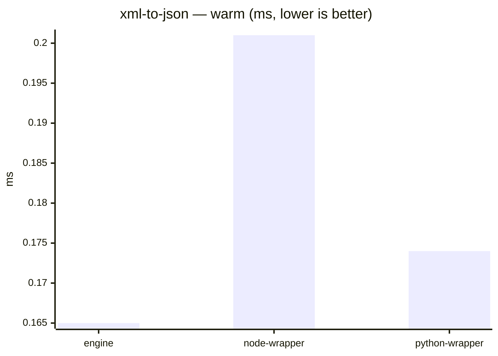

# DataWeave benchmark results

_Generated from commit `025d35a` on 2026-07-24T18:51:16.296Z._

**Environment** (Apple M4 Max, Mac OS X-aarch64):  
`engine` — jvm 17.0.16, weave 2.12.0-20260413  
`node-wrapper` — node v22.23.0, weave 2.12.0-20260413  
`python-wrapper` — python 3.9.6, weave 2.12.0-20260413

> Indicative only — timings are from a single run on one machine, not a dedicated bench box.

## Table

| case | metric | unit | engine | node-wrapper | python-wrapper | Δ vs engine |
| --- | --- | --- | --- | --- | --- | --- |
| trivial | cold-start | ms | 167.72 | 40.46 | 41.62 | -75.9% |
| trivial | first-run | ms | 373.34 | 8.95 | 8.94 | -97.6% |
| trivial | warm | ms | 0.11 | 0.09 | 0.08 | -10.7% |
| object-transform | first-run | ms | 686.03 | 17.95 | 17.11 | -97.4% |
| object-transform | warm | ms | 0.27 | 0.24 | 0.22 | -10.2% |
| map-scale | first-run | ms | 841.17 | 148.36 | 145.24 | -82.4% |
| map-scale | warm | ms | 34.15 | 118.77 | 120.78 | +247.8% |
| map-scale | streaming | MB/s | 58.26 | 26.56 | 29.63 | -54.4% |
| xml-to-csv | first-run | ms | 375.49 | 9.67 | 9.01 | -97.4% |
| xml-to-csv | warm | ms | 0.10 | 0.11 | 0.09 | +7.7% |
| json-stream | first-run | ms | 792.66 | 131.29 | 128.31 | -83.4% |
| json-stream | warm | ms | 26.82 | 104.45 | 103.02 | +289.4% |
| json-stream | streaming | MB/s | 80.02 | 33.61 | 37.08 | -58.0% |
| compile-heavy | first-run | ms | 712.84 | 19.16 | 18.08 | -97.3% |
| compile-heavy | warm | ms | 1.11 | 0.97 | 0.84 | -13.4% |
| csv-to-json | first-run | ms | 709.21 | 18.48 | 17.17 | -97.4% |
| csv-to-json | warm | ms | 0.15 | 0.19 | 0.17 | +25.2% |
| xml-to-json | first-run | ms | 740.39 | 18.81 | 17.26 | -97.5% |
| xml-to-json | warm | ms | 0.16 | 0.20 | 0.17 | +21.8% |
| deep-selector | first-run | ms | 377.01 | 9.68 | 8.97 | -97.4% |
| deep-selector | warm | ms | 0.08 | 0.13 | 0.10 | +51.2% |
| group-by | first-run | ms | 992.31 | 206.92 | 198.60 | -79.1% |
| group-by | warm | ms | 74.82 | 170.61 | 171.37 | +128.0% |

## Charts

One chart per corpus case, one bar per runner (`engine`, `node-wrapper`, `python-wrapper`). A case's metrics differ in unit and scale, so each metric is a separate single-unit chart. `engine` is the table's delta baseline.

### trivial




### object-transform




### map-scale




### xml-to-csv




### json-stream






### compile-heavy




### csv-to-json




### xml-to-json




### deep-selector


```mermaid
xychart-beta
    title "deep-selector — warm (ms, lower is better)"
    x-axis ["engine", "node-wrapper", "python-wrapper"]
    y-axis "ms"
    bar [0.084, 0.127, 0.102]
```

### group-by

```mermaid
xychart-beta
    title "group-by — first-run (ms, lower is better)"
    x-axis ["engine", "node-wrapper", "python-wrapper"]
    y-axis "ms"
    bar [992.312, 206.924, 198.599]
```

```mermaid
xychart-beta
    title "group-by — warm (ms, lower is better)"
    x-axis ["engine", "node-wrapper", "python-wrapper"]
    y-axis "ms"
    bar [74.821, 170.61, 171.369]
```
