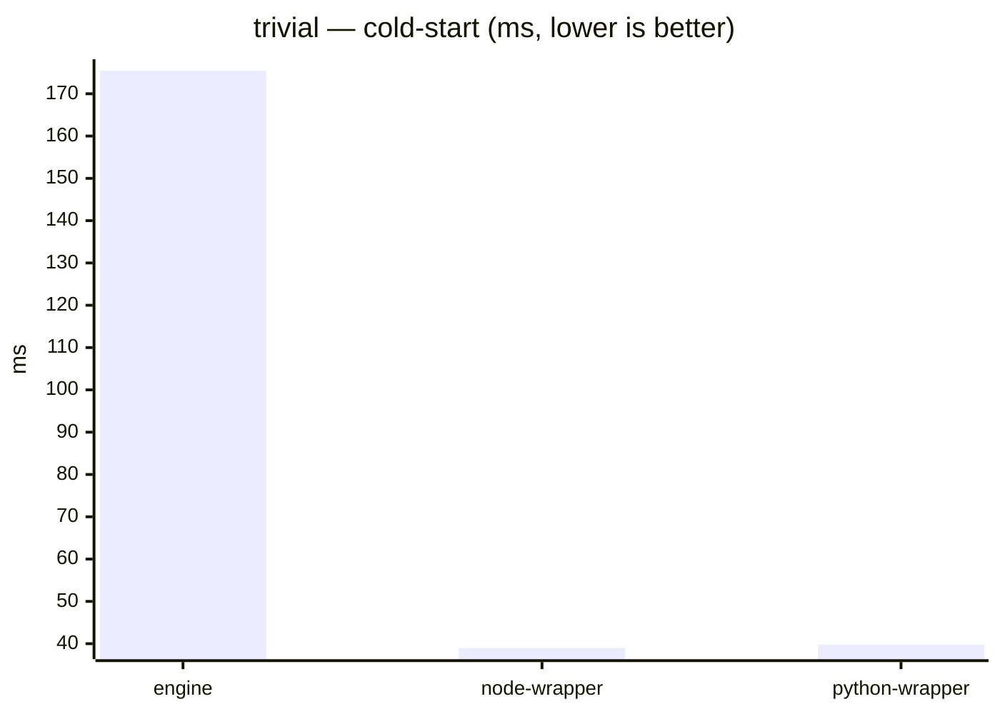
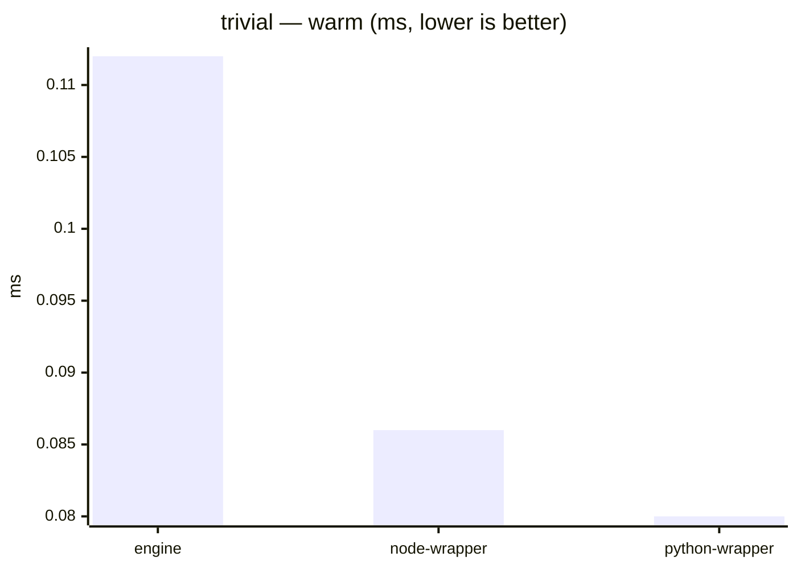
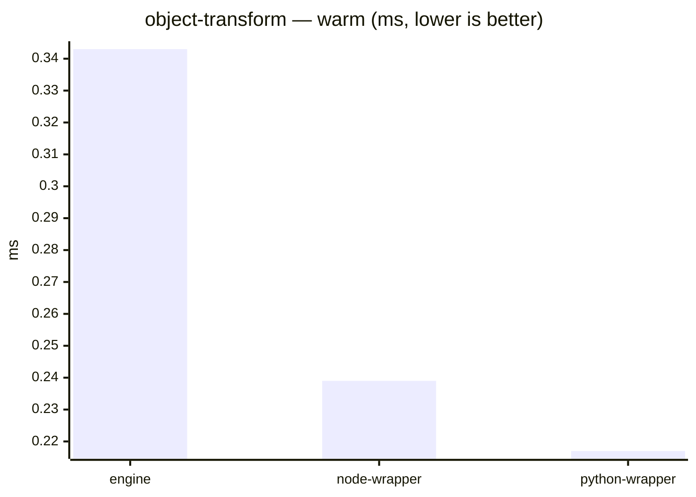
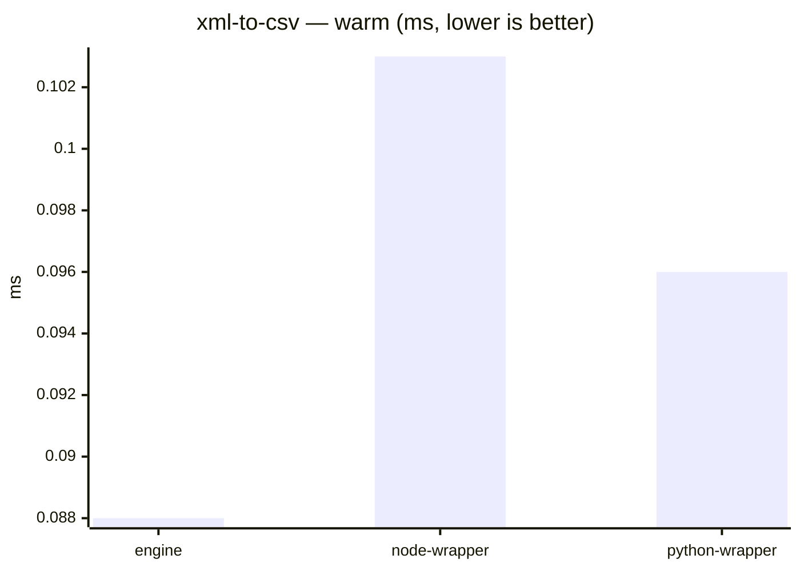
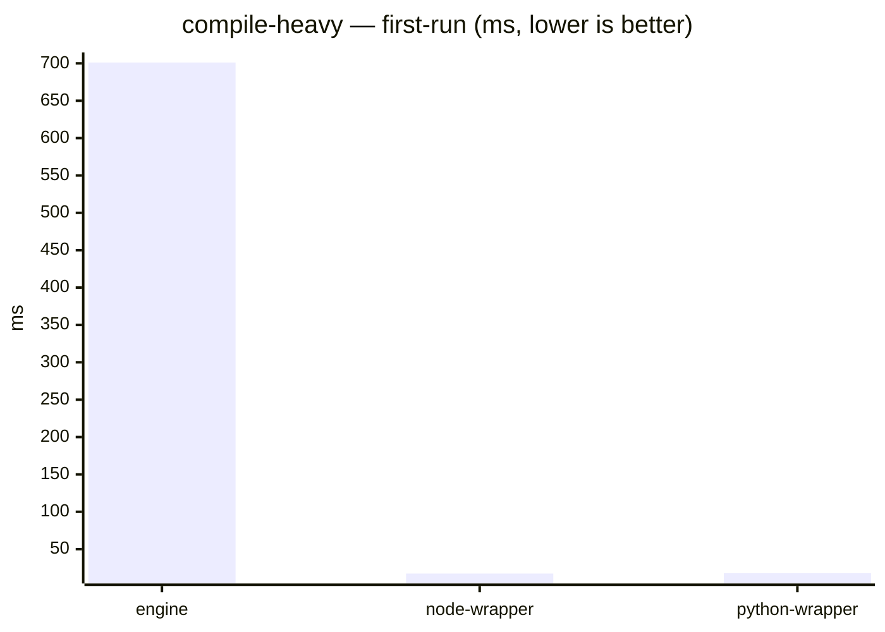
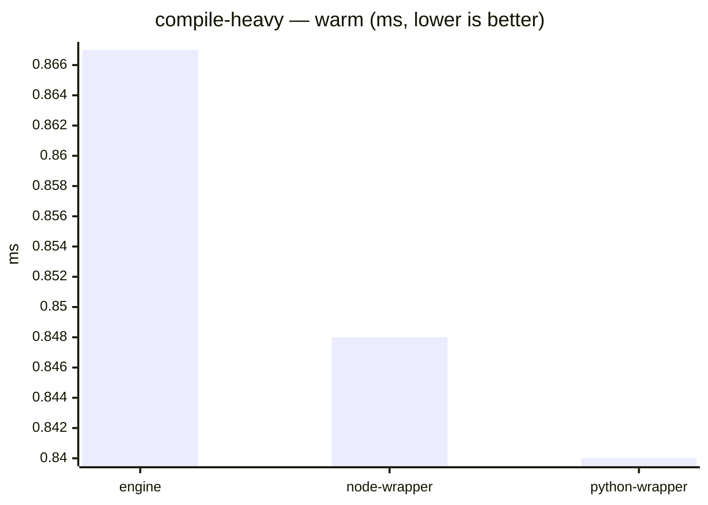
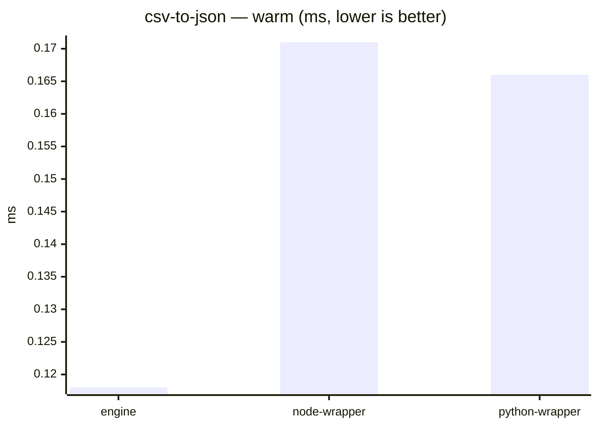
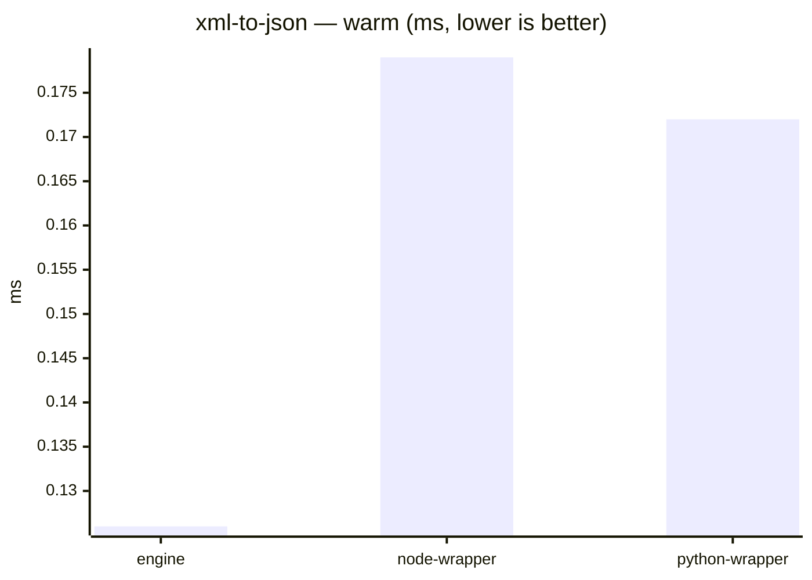

# DataWeave benchmark results

_Generated from commit `f4bca0d` on 2026-07-24T20:28:12.909Z._

**Environment** (Apple M4 Max, Mac OS X-aarch64):  
`engine` — jvm 21.0.11, weave 2.12.0-20260413  
`node-wrapper` — node v22.23.0, weave 2.12.0-20260413  
`python-wrapper` — python 3.9.6, weave 2.12.0-20260413

> Indicative only — timings are from a single run on one machine, not a dedicated bench box.

## Table

| case | metric | unit | engine | node-wrapper | python-wrapper | Δ node-wrapper vs engine | Δ python-wrapper vs engine |
| --- | --- | --- | --- | --- | --- | --- | --- |
| trivial | cold-start | ms | 175.48 | 38.99 | 39.79 | -77.8% | -77.3% |
| trivial | first-run | ms | 347.90 | 8.65 | 8.93 | -97.5% | -97.4% |
| trivial | warm | ms | 0.11 | 0.09 | 0.08 | -23.2% | -28.4% |
| object-transform | first-run | ms | 656.29 | 16.49 | 17.65 | -97.5% | -97.3% |
| object-transform | warm | ms | 0.34 | 0.24 | 0.22 | -30.4% | -36.7% |
| map-scale | first-run | ms | 785.94 | 141.34 | 144.58 | -82.0% | -81.6% |
| map-scale | warm | ms | 33.77 | 115.52 | 117.89 | +242.1% | +249.1% |
| map-scale | streaming | MB/s | 56.23 | 29.39 | 30.17 | -47.7% | -46.4% |
| xml-to-csv | first-run | ms | 356.13 | 8.62 | 9.01 | -97.6% | -97.5% |
| xml-to-csv | warm | ms | 0.09 | 0.10 | 0.10 | +16.5% | +8.8% |
| json-stream | first-run | ms | 743.44 | 125.23 | 126.95 | -83.2% | -82.9% |
| json-stream | warm | ms | 25.87 | 99.79 | 101.11 | +285.8% | +290.9% |
| json-stream | streaming | MB/s | 75.43 | 37.08 | 38.31 | -50.8% | -49.2% |
| compile-heavy | first-run | ms | 701.18 | 17.36 | 17.84 | -97.5% | -97.5% |
| compile-heavy | warm | ms | 0.87 | 0.85 | 0.84 | -2.1% | -3.1% |
| csv-to-json | first-run | ms | 669.11 | 16.35 | 17.12 | -97.6% | -97.4% |
| csv-to-json | warm | ms | 0.12 | 0.17 | 0.17 | +44.9% | +41.0% |
| xml-to-json | first-run | ms | 693.56 | 16.70 | 16.95 | -97.6% | -97.6% |
| xml-to-json | warm | ms | 0.13 | 0.18 | 0.17 | +42.2% | +37.1% |
| deep-selector | first-run | ms | 348.25 | 8.61 | 8.93 | -97.5% | -97.4% |
| deep-selector | warm | ms | 0.07 | 0.12 | 0.10 | +82.7% | +53.9% |
| group-by | first-run | ms | 919.06 | 196.34 | 199.28 | -78.6% | -78.3% |
| group-by | warm | ms | 57.42 | 168.43 | 170.83 | +193.3% | +197.5% |

## Charts

One chart per corpus case, one bar per runner (`engine`, `node-wrapper`, `python-wrapper`). A case's metrics differ in unit and scale, so each metric is a separate single-unit chart. `engine` is the table's delta baseline; each other runner gets its own Δ column.

### trivial






### object-transform




### map-scale


### xml-to-csv




### json-stream


### compile-heavy





### csv-to-json




### xml-to-json




### deep-selector


```mermaid
xychart-beta
    title "deep-selector — warm (ms, lower is better)"
    x-axis ["engine", "node-wrapper", "python-wrapper"]
    y-axis "ms"
    bar [0.067, 0.122, 0.102]
```

### group-by

```mermaid
xychart-beta
    title "group-by — first-run (ms, lower is better)"
    x-axis ["engine", "node-wrapper", "python-wrapper"]
    y-axis "ms"
    bar [919.061, 196.338, 199.279]
```

```mermaid
xychart-beta
    title "group-by — warm (ms, lower is better)"
    x-axis ["engine", "node-wrapper", "python-wrapper"]
    y-axis "ms"
    bar [57.416, 168.427, 170.826]
```
