# DataWeave benchmark results

_Generated from commit `0cd78a1` on 2026-07-24T14:33:03.805941Z._

**Environment** (Apple M4 Max, Mac OS X-aarch64):  
`engine` — jvm 17.0.16, weave 2.12.0-20260413  
`node-wrapper` — node v22.23.0, weave 2.12.0-20260413  
`python-wrapper` — python 3.9.6, weave 2.12.0-20260413

> Indicative only — timings are from a single run on one machine, not a dedicated bench box.

## Table

| case | metric | unit | engine | node-wrapper | python-wrapper | Δ vs engine |
| --- | --- | --- | --- | --- | --- | --- |
| trivial | cold-start | ms | 148.72 | 38.44 | 39.33 | -74.1% |
| trivial | first-run | ms | 324.17 | 8.34 | 8.59 | -97.4% |
| trivial | warm | ms | 0.10 | 0.08 | 0.08 | -17.4% |
| object-transform | first-run | ms | 635.23 | 16.30 | 16.80 | -97.4% |
| object-transform | warm | ms | 0.28 | 0.23 | 0.22 | -18.1% |
| map-scale | first-run | ms | 764.13 | 140.45 | 144.91 | -81.6% |
| map-scale | warm | ms | 35.58 | 117.66 | 117.99 | +230.6% |
| map-scale | streaming | MB/s | 59.03 | 29.71 | 29.56 | n/a |
| xml-to-csv | first-run | ms | 337.29 | 8.63 | 9.48 | -97.4% |
| xml-to-csv | warm | ms | 0.10 | 0.13 | 0.09 | +29.9% |
| json-stream | first-run | ms | 717.85 | 122.23 | 127.18 | -83.0% |
| json-stream | warm | ms | 26.62 | 99.34 | 100.08 | +273.1% |
| json-stream | streaming | MB/s | 77.89 | 37.92 | 37.83 | n/a |
| compile-heavy | first-run | ms | 646.98 | 17.02 | 18.00 | -97.4% |
| compile-heavy | warm | ms | 1.02 | 0.84 | 1.06 | -17.9% |
| csv-to-json | first-run | ms | 616.73 | 16.28 | 17.50 | -97.4% |
| csv-to-json | warm | ms | 0.16 | 0.18 | 0.17 | +15.7% |
| xml-to-json | first-run | ms | 628.10 | 16.23 | 17.23 | -97.4% |
| xml-to-json | warm | ms | 0.17 | 0.18 | 0.17 | +6.5% |
| deep-selector | first-run | ms | 323.61 | 8.64 | 8.77 | -97.3% |
| deep-selector | warm | ms | 0.08 | 0.11 | 0.10 | +33.4% |
| group-by | first-run | ms | 842.98 | 193.86 | 197.31 | -77.0% |
| group-by | warm | ms | 71.51 | 171.33 | 169.72 | +139.6% |

> `n/a` deltas mark metrics that are not like-for-like across runners: the engine's `streaming` times a full compile+write of the whole input per iteration, while native-lib runners time an incrementally-chunked transform. Compare each runner's absolute `streaming` throughput, not the delta.

## Charts

One chart per corpus case, one bar per runner (`engine`, `node-wrapper`, `python-wrapper`). A case's metrics differ in unit and scale, so each metric is a separate single-unit chart. `engine` is the table's delta baseline.

### trivial


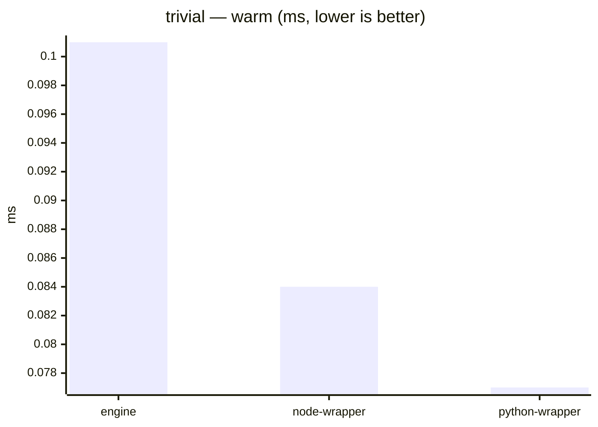

### object-transform


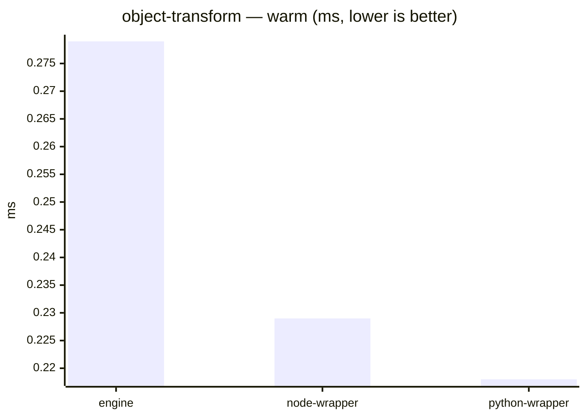

### map-scale


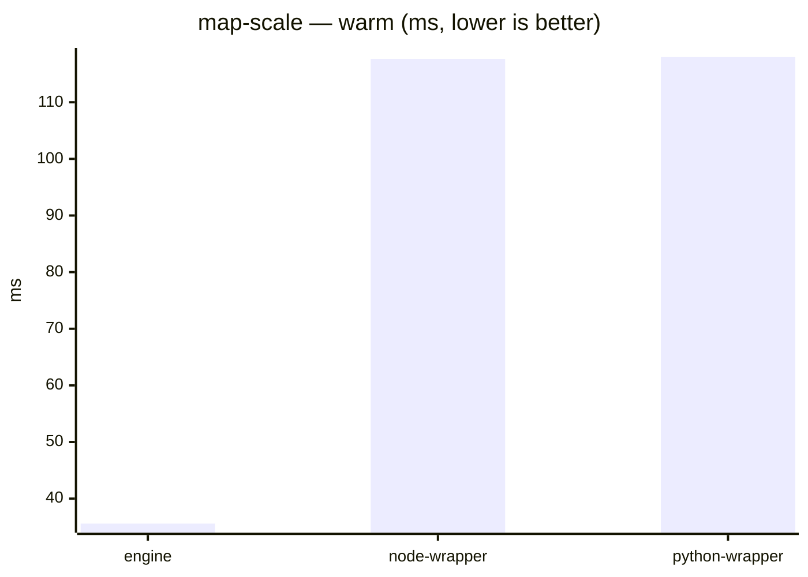

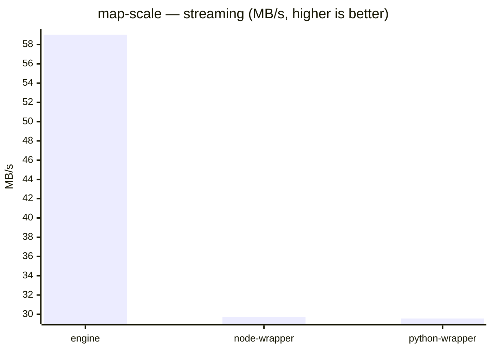

### xml-to-csv


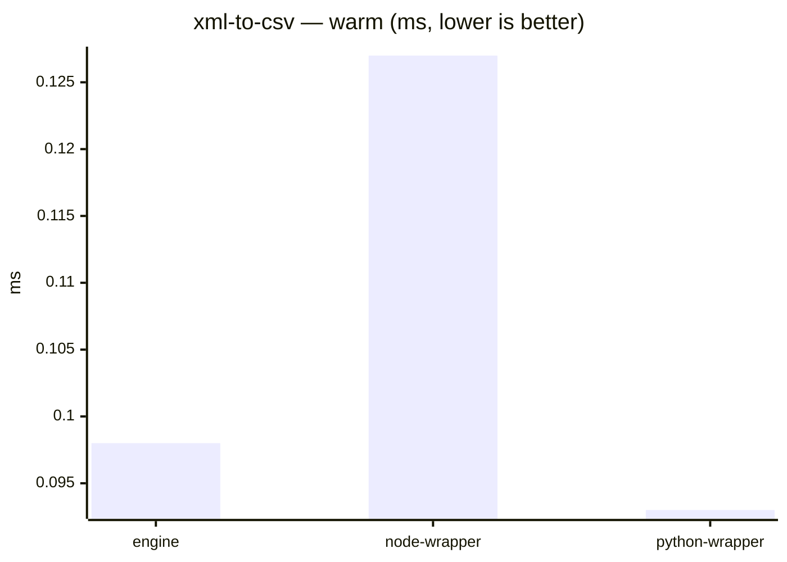

### json-stream

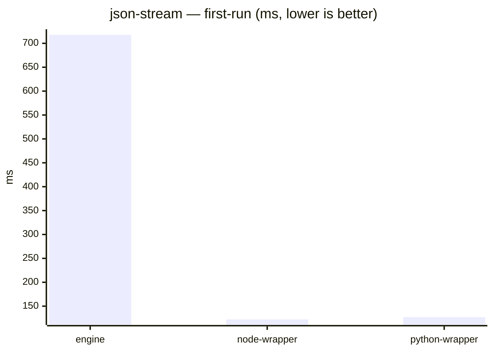

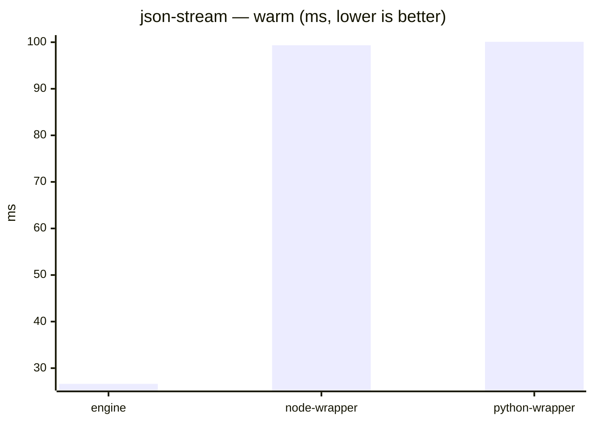

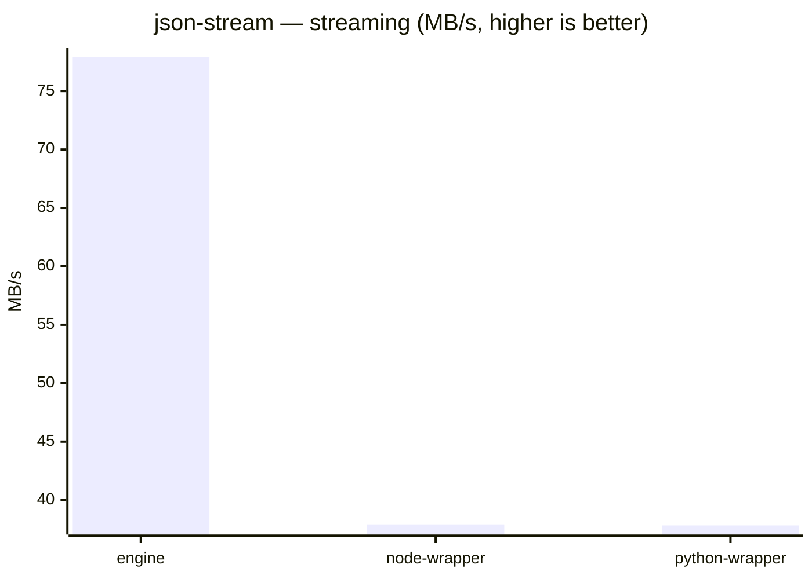

### compile-heavy


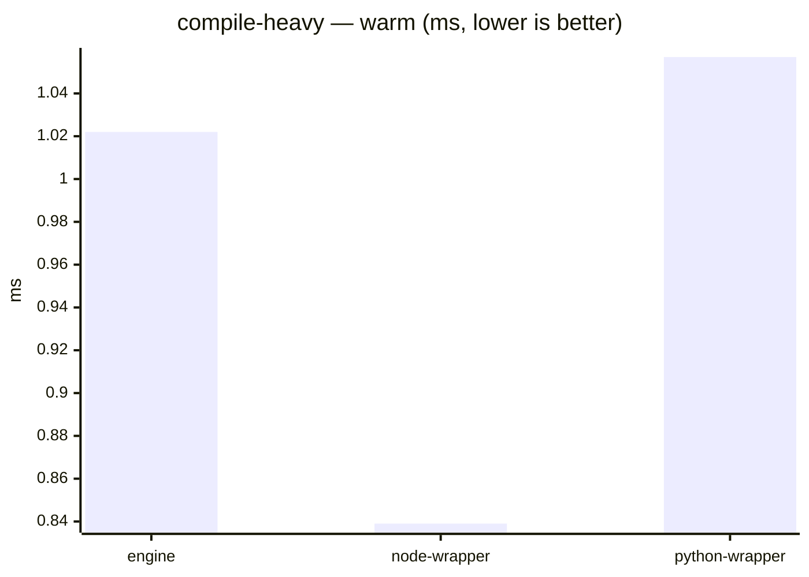

### csv-to-json


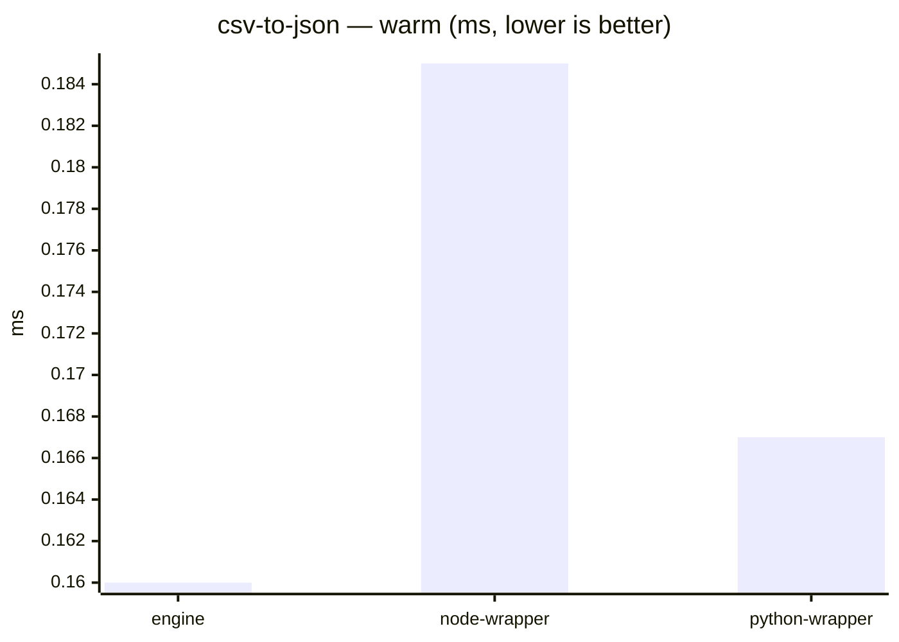

### xml-to-json


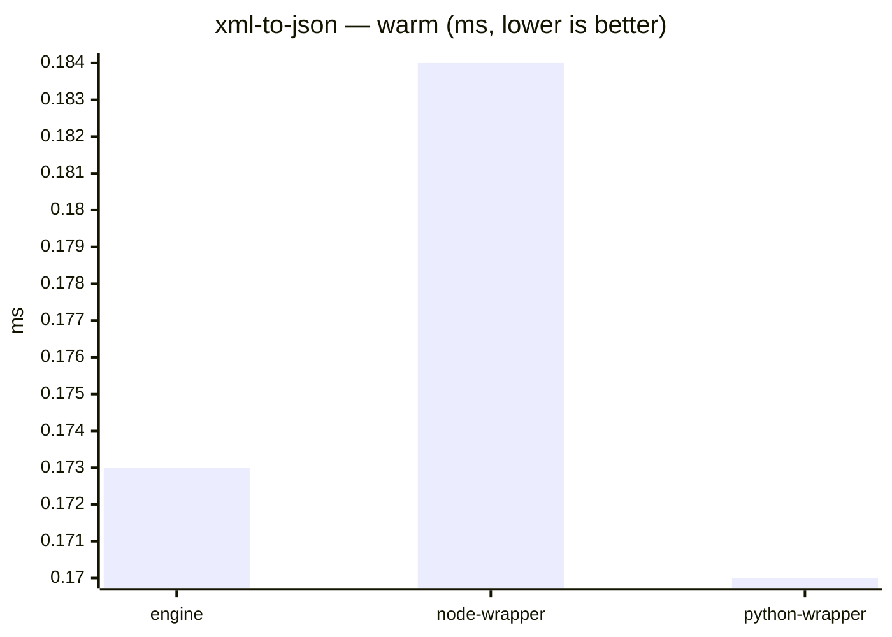

### deep-selector


```mermaid
xychart-beta
    title "deep-selector — warm (ms, lower is better)"
    x-axis ["engine", "node-wrapper", "python-wrapper"]
    y-axis "ms"
    bar [0.084, 0.112, 0.099]
```

### group-by

```mermaid
xychart-beta
    title "group-by — first-run (ms, lower is better)"
    x-axis ["engine", "node-wrapper", "python-wrapper"]
    y-axis "ms"
    bar [842.983, 193.864, 197.309]
```

```mermaid
xychart-beta
    title "group-by — warm (ms, lower is better)"
    x-axis ["engine", "node-wrapper", "python-wrapper"]
    y-axis "ms"
    bar [71.505, 171.332, 169.718]
```
