# DataWeave benchmark results

_Generated from commit `d6611d4` on 2026-07-24T19:27:26.294Z._

**Environment** (Apple M4 Max, Mac OS X-aarch64):  
`engine` — jvm 17.0.16, weave 2.12.0-20260413  
`node-wrapper` — node v22.23.0, weave 2.12.0-20260413  
`python-wrapper` — python 3.9.6, weave 2.12.0-20260413

> Indicative only — timings are from a single run on one machine, not a dedicated bench box.

## Table

| case | metric | unit | engine | node-wrapper | python-wrapper | Δ vs engine |
| --- | --- | --- | --- | --- | --- | --- |
| trivial | cold-start | ms | 149.48 | 38.14 | 42.67 | -74.5% |
| trivial | first-run | ms | 309.21 | 8.53 | 8.78 | -97.2% |
| trivial | warm | ms | 0.10 | 0.09 | 0.08 | -11.0% |
| object-transform | first-run | ms | 583.65 | 16.73 | 17.01 | -97.1% |
| object-transform | warm | ms | 0.26 | 0.24 | 0.22 | -9.8% |
| map-scale | first-run | ms | 700.98 | 145.62 | 146.48 | -79.2% |
| map-scale | warm | ms | 33.50 | 117.51 | 118.96 | +250.7% |
| map-scale | streaming | MB/s | 52.43 | 28.53 | 29.66 | -45.6% |
| xml-to-csv | first-run | ms | 323.17 | 8.62 | 8.83 | -97.3% |
| xml-to-csv | warm | ms | 0.10 | 0.11 | 0.09 | +4.2% |
| json-stream | first-run | ms | 673.21 | 126.30 | 127.67 | -81.2% |
| json-stream | warm | ms | 26.41 | 100.12 | 101.72 | +279.0% |
| json-stream | streaming | MB/s | 69.23 | 35.84 | 37.90 | -48.2% |
| compile-heavy | first-run | ms | 619.24 | 17.91 | 18.13 | -97.1% |
| compile-heavy | warm | ms | 1.07 | 0.86 | 0.84 | -19.7% |
| csv-to-json | first-run | ms | 595.66 | 16.63 | 17.06 | -97.2% |
| csv-to-json | warm | ms | 0.16 | 0.18 | 0.17 | +14.8% |
| xml-to-json | first-run | ms | 609.17 | 16.80 | 17.22 | -97.2% |
| xml-to-json | warm | ms | 0.17 | 0.19 | 0.17 | +13.6% |
| deep-selector | first-run | ms | 318.98 | 8.65 | 9.08 | -97.3% |
| deep-selector | warm | ms | 0.09 | 0.11 | 0.10 | +34.5% |
| group-by | first-run | ms | 809.04 | 199.03 | 201.40 | -75.4% |
| group-by | warm | ms | 70.83 | 168.45 | 171.07 | +137.8% |

## Charts

One chart per corpus case, one bar per runner (`engine`, `node-wrapper`, `python-wrapper`). A case's metrics differ in unit and scale, so each metric is a separate single-unit chart. `engine` is the table's delta baseline.

### trivial

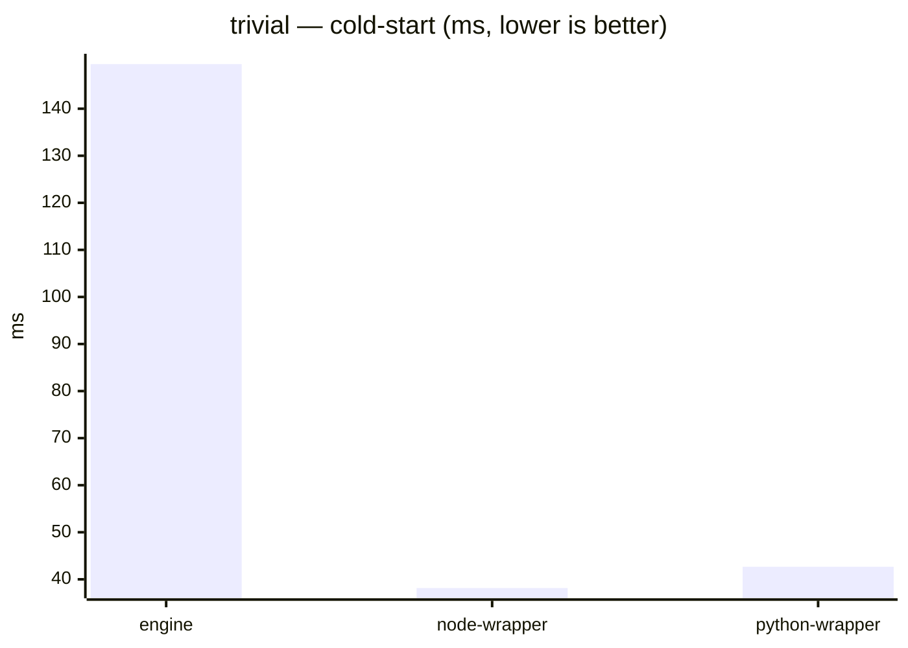


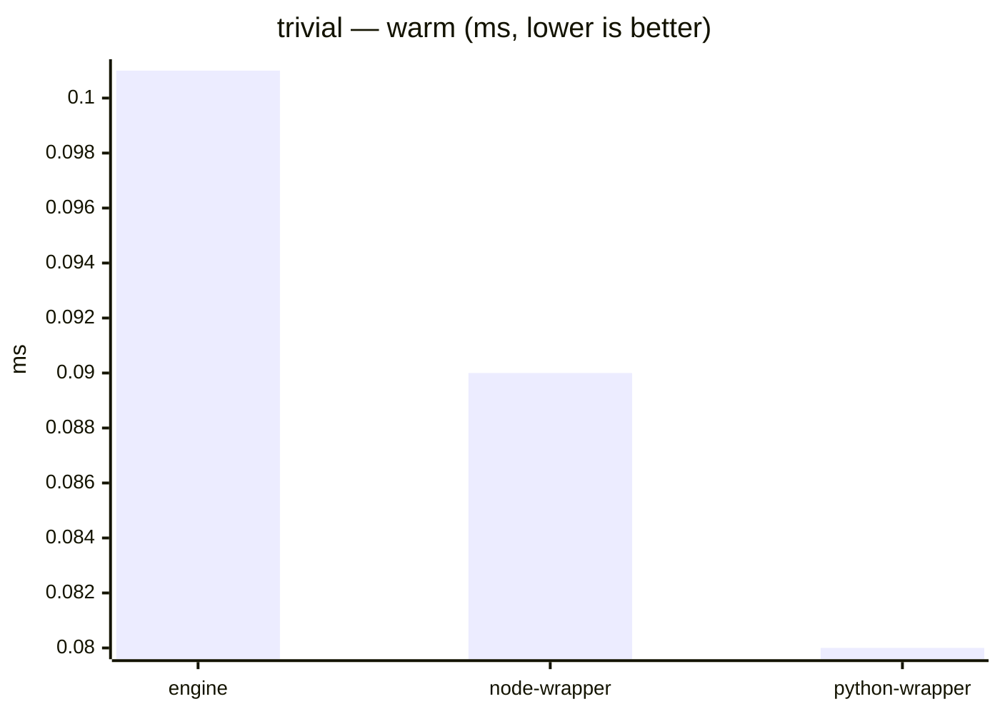

### object-transform


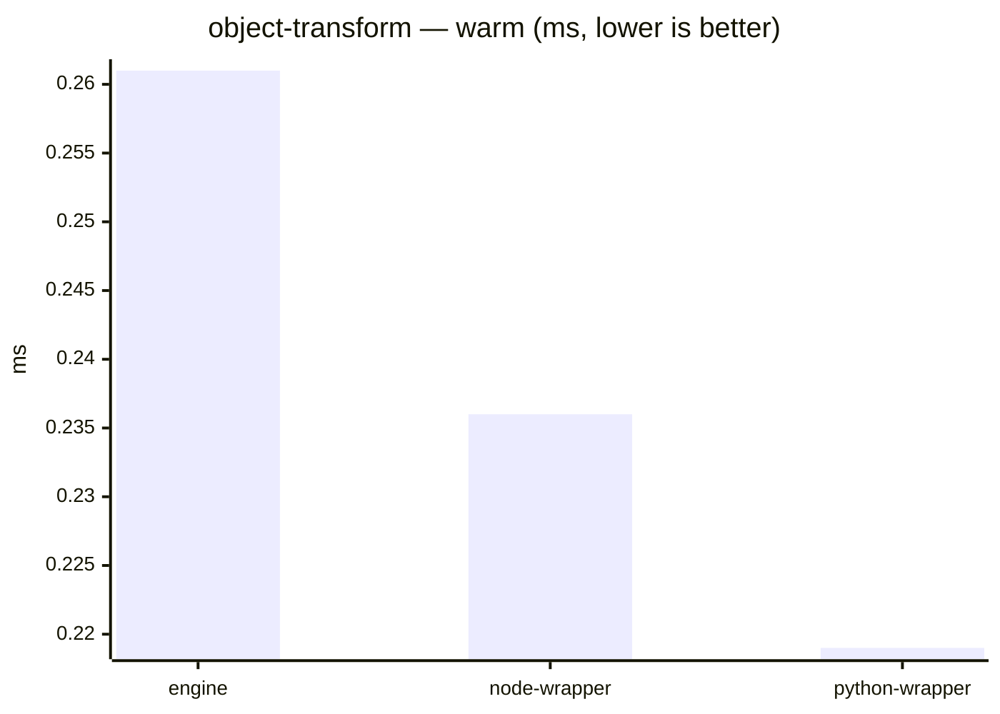

### map-scale


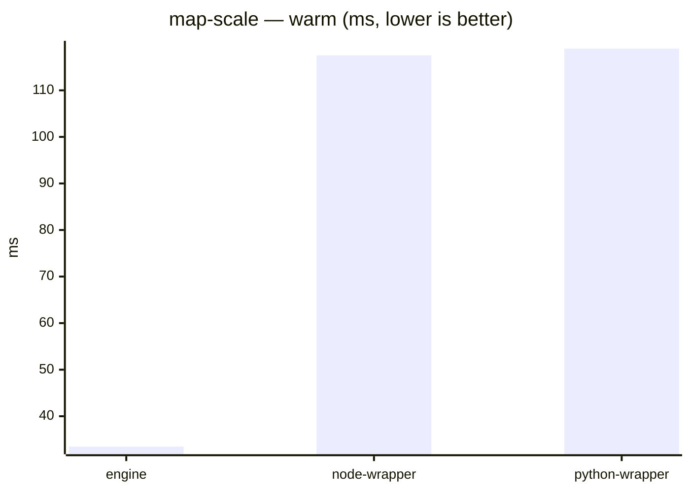

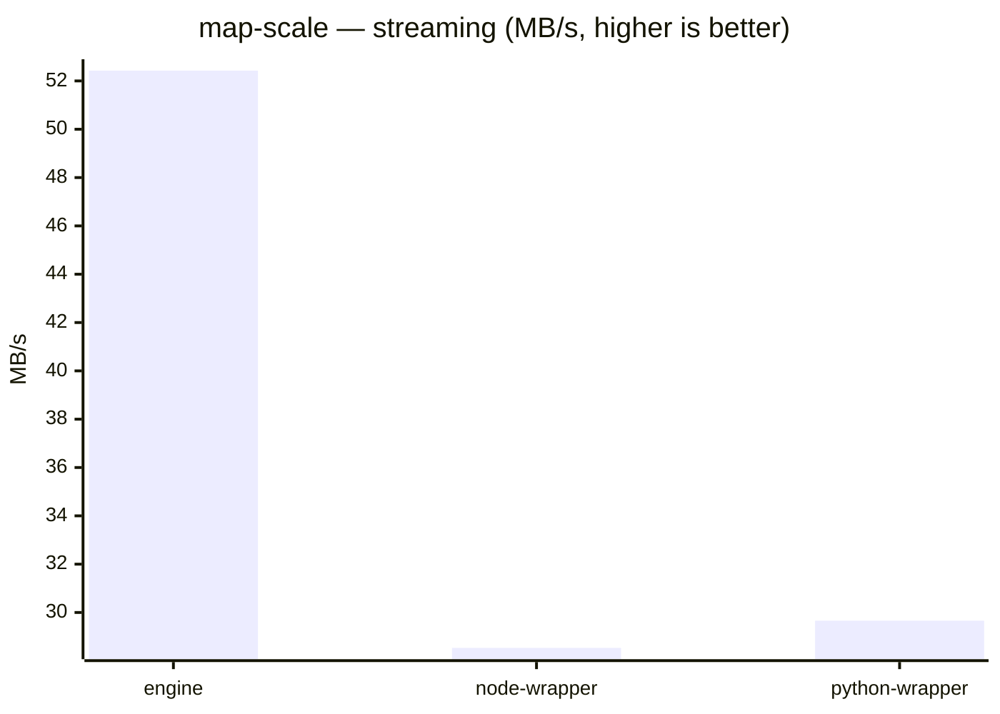

### xml-to-csv


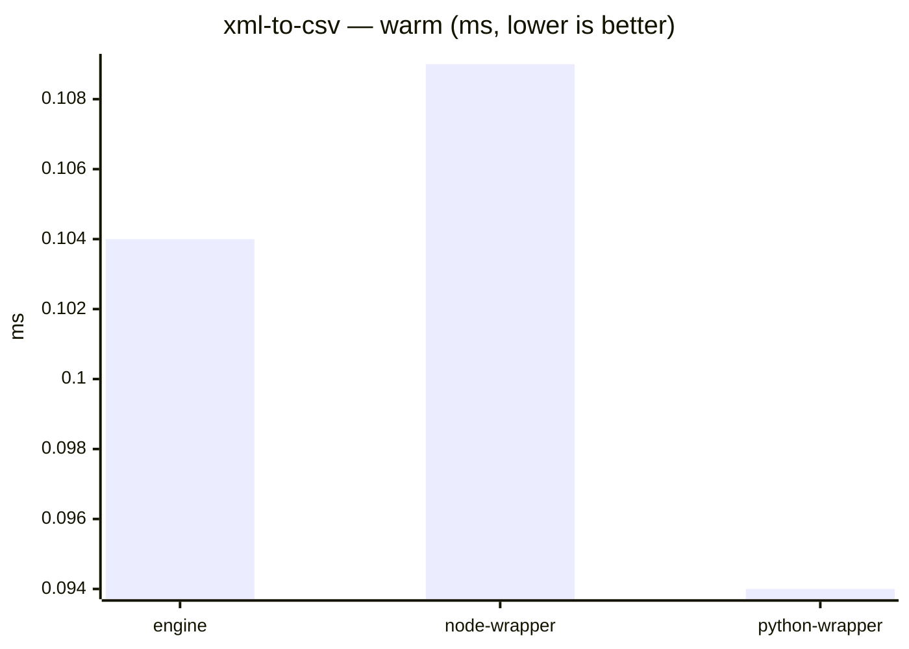

### json-stream


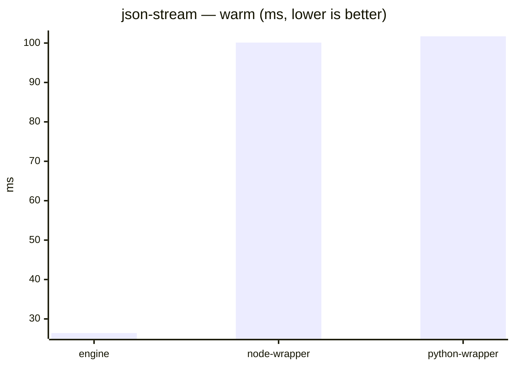

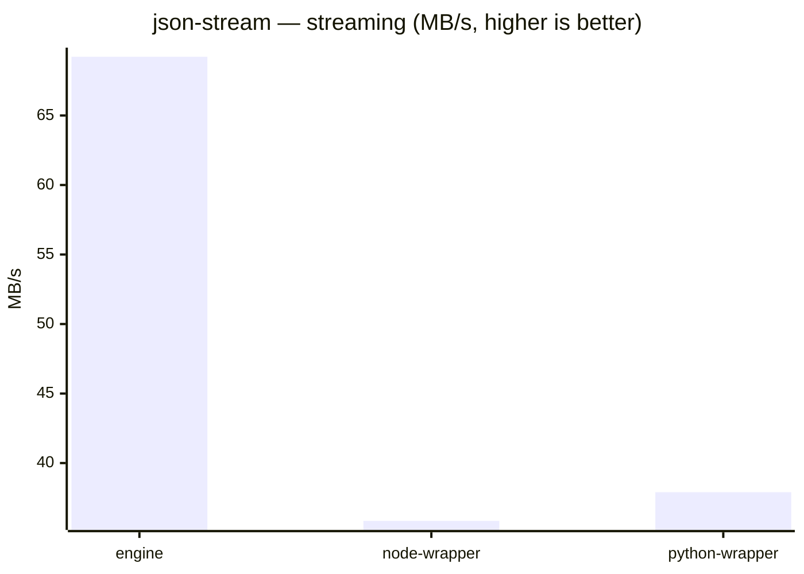

### compile-heavy


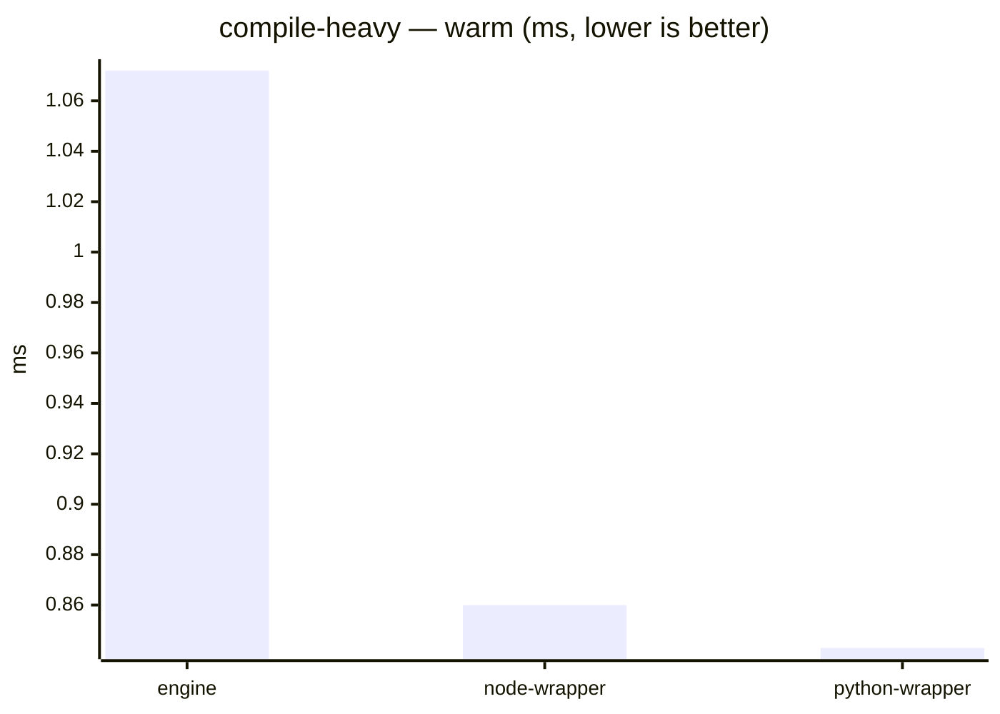

### csv-to-json

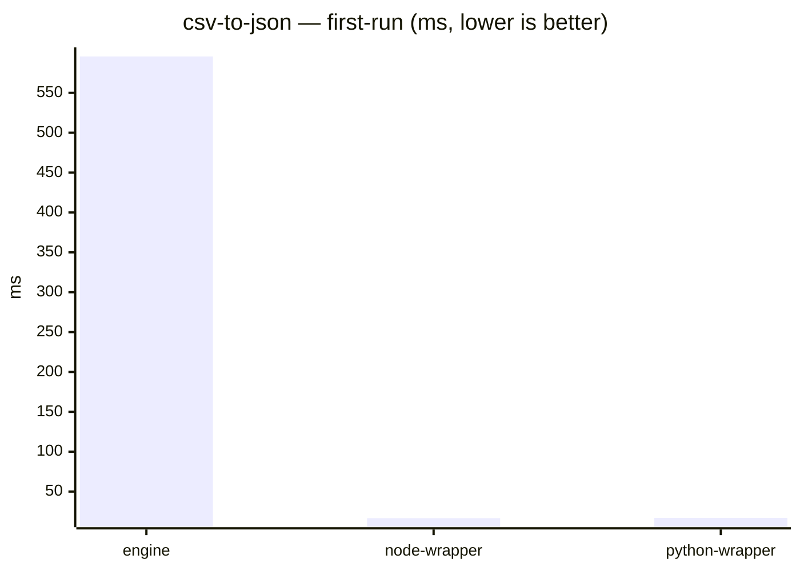

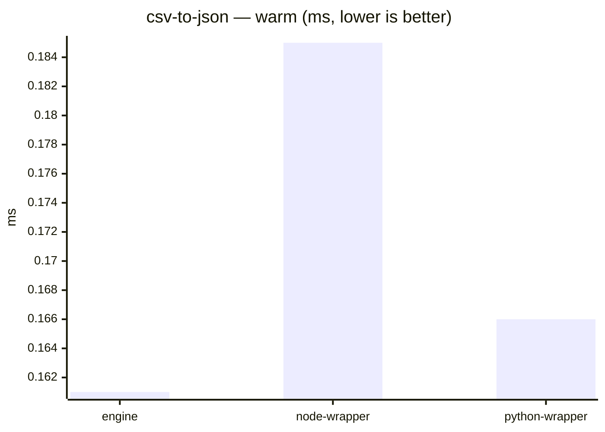

### xml-to-json


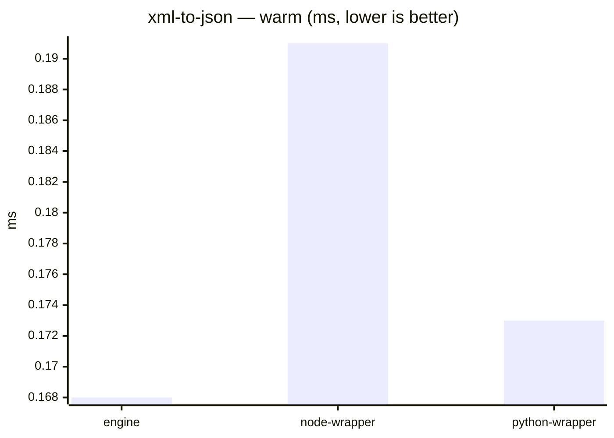

### deep-selector


```mermaid
xychart-beta
    title "deep-selector — warm (ms, lower is better)"
    x-axis ["engine", "node-wrapper", "python-wrapper"]
    y-axis "ms"
    bar [0.085, 0.115, 0.103]
```

### group-by

```mermaid
xychart-beta
    title "group-by — first-run (ms, lower is better)"
    x-axis ["engine", "node-wrapper", "python-wrapper"]
    y-axis "ms"
    bar [809.044, 199.029, 201.398]
```

```mermaid
xychart-beta
    title "group-by — warm (ms, lower is better)"
    x-axis ["engine", "node-wrapper", "python-wrapper"]
    y-axis "ms"
    bar [70.834, 168.445, 171.073]
```
