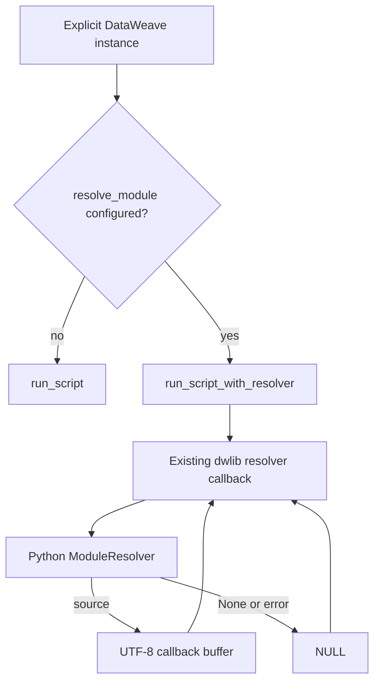

# Python External DataWeave Module Resolver

**Date:** 2026-08-24
**Module:** `native-lib` Python binding
**Related implementation:** Node external-module support in PR #154

## Problem

The Python binding cannot resolve reusable DataWeave modules supplied by an
application. Scripts using imports such as `org::company::lib` therefore fail
unless the module is built into `dwlib`. This also leaves Python TCK scenarios
excluded even though the Node binding executes equivalent scenarios through its
module resolver.

`dwlib` already exports `run_script_with_resolver`, and its callback ABI is
host-neutral. The Python binding can use that existing export directly through
`ctypes`; this feature does not require Java, native-image, or Node binding
changes.

## Goals

1. Give the Python synchronous `DataWeave.run()` API external-module parity
   with Node.
2. Support a user-provided synchronous resolver callable.
3. Provide Python equivalents of Node's map, directory, JAR, and composition
   resolver factories.
4. Re-enable Python TCK scenarios that become runnable through the same
   committed module fixture used by Node.
5. Preserve the existing native ABI and leave every file under
   `native-lib/node` unchanged.

## Non-goals

- Resolver support for `run_streaming`, `run_transform`, or callback streaming.
- Configuring the module-level `dataweave.run()` singleton with a resolver.
- Running the 17 structurally skipped TCK cases that bundle adjacent `.dwl`
  files beside `transform.dwl`.
- Changing the native resolver model. Each Python `DataWeave` keeps its current
  dedicated Graal isolate; the first resolver-backed run in that isolate
  installs its configured resolver.
- Changes to Java, GraalVM entry points, generated headers, or Node sources.

## Public API

Add `dataweave/resolver.py` with snake_case Python APIs:

```python
from collections.abc import Callable, Mapping, Sequence
from pathlib import Path
from typing import Optional, Union

ModuleResolver = Callable[[str], Optional[str]]

def modules_from_map(modules: Mapping[str, str]) -> ModuleResolver: ...
def modules_from_directory(base_dir: Union[str, Path]) -> ModuleResolver: ...
def modules_from_jars(jar_paths: Sequence[Union[str, Path]]) -> ModuleResolver: ...
def compose_resolvers(*resolvers: ModuleResolver) -> ModuleResolver: ...
```

Extend explicit runtime construction:

```python
class DataWeave:
    def __init__(
        self,
        lib_path: Optional[str] = None,
        *,
        resolve_module: Optional[ModuleResolver] = None,
    ): ...
```

Example:

```python
from dataweave import DataWeave, modules_from_map

resolver = modules_from_map({
    "org/company/lib.dwl": '%dw 2.0\nfun greet(name) = "Hello " ++ name',
})

with DataWeave(resolve_module=resolver) as dw:
    result = dw.run("""
        %dw 2.0
        import org::company::lib
        output application/json
        ---
        lib::greet("World")
    """)
```

Export `ModuleResolver`, all four factories, and the existing public symbols
from `dataweave.__init__`.

The module-level convenience functions remain unchanged. Like Node, callers
must construct a `DataWeave` instance to provide `resolve_module`.

## Resolver Factories

### `modules_from_map`

Copy the input mapping at factory construction and perform exact path lookup.
Return the mapped source or `None`. The copy prevents later caller mutation
from changing resolver behavior unexpectedly.

### `modules_from_directory`

Capture both the absolute lexical root and canonical root when constructing the
resolver. Fail construction if the base directory does not exist.

For every lookup:

1. Resolve the requested module path beneath the captured lexical root.
2. Reject `..`, absolute-path, and different-root escapes before filesystem I/O.
3. Canonicalize the candidate and return `None` when it does not exist.
4. Reject symlinks whose canonical target escapes the canonical root.
5. Read the module as UTF-8 on each lookup.

This follows Node's security and current-working-directory stability behavior.
Missing files return `None`; permission, directory, decoding, and other I/O
failures raise a contextual exception.

### `modules_from_jars`

Use the Python standard library's `zipfile` module, so no runtime dependency is
added. Read every non-directory `.dwl` entry into an in-memory map and return a
map-backed synchronous resolver. Process JARs in caller order; a later archive
overwrites a duplicate path from an earlier archive, matching Node behavior.
Malformed or unreadable archives raise an exception naming the archive.

Unlike Node, this factory itself is synchronous because Python's standard ZIP
API is synchronous. The returned resolver has the same synchronous contract.

### `compose_resolvers`

Call resolvers in order and return the first non-`None` source. Return `None`
when none resolve the path. Resolver exceptions propagate to the ctypes bridge,
where they follow the callback error policy below.

## Execution Flow



`DataWeave.run()` keeps its current input encoding, result parsing,
`raise_on_error`, and exception-wrapping behavior. It selects only the native
entry point:

- no configured resolver: `run_script`;
- configured resolver: `run_script_with_resolver`.

Streaming methods deliberately remain on their resolver-less native entry
points and therefore have access only to built-in modules.

## ctypes ABI Bridge

Define a Python callback type matching the existing ABI:

```c
char *resolve_module(void *isolate_thread, const char *module_path);
```

Configure `run_script_with_resolver` with these arguments:

1. `GraalIsolateThreadPointer`
2. script `c_char_p`
3. inputs JSON `c_char_p`
4. resolver callback

Its result remains an unmanaged C string decoded and released through the
existing `decode_and_free` path.

The callback bridge:

1. Decodes `module_path` as UTF-8.
2. Removes exactly one leading `/`, matching the Node adapter and public
   separator-less keys.
3. Invokes the configured Python resolver synchronously.
4. Accepts only `str` or `None`.
5. Encodes a returned string as UTF-8 into a `ctypes` buffer.
6. Keeps every returned buffer strongly referenced until the enclosing
   `run_script_with_resolver` call returns.
7. Clears those references in `finally`, after Java has copied callback output
   into a managed string.

The `ctypes` callback object itself is retained by the `DataWeave` instance
until its isolate is torn down. No Python exception is allowed to unwind
through the C callback.

## Capability Detection

`NativeRuntime._setup_functions()` detects `run_script_with_resolver` and
configures its signature when present. It records a capability flag analogous
to the existing streaming flags.

Constructing or initializing a `DataWeave` with a resolver remains possible so
normal lifecycle behavior is unchanged. The first resolver-backed `run()`
against a library lacking the export raises `DataWeaveError` with operation
context and the missing symbol name. Resolver-less execution remains compatible
with older libraries.

## Error and Security Policy

Resolver outcomes are translated as follows:

| Outcome | Callback result | Visible behavior |
|---|---|---|
| Source string | UTF-8 C pointer | Module compiles normally |
| `None` | `NULL` | DataWeave module-not-found result |
| Non-string value | `NULL` | Invalid resolver result treated as not found |
| Path UTF-8 decode failure | `NULL` | Module not found |
| Resolver exception | `NULL` | Module not found |

By default, callback errors write only a fixed, content-free diagnostic to
stderr. Resolver exceptions may contain module source, credentials, or local
paths, so their details must not be logged automatically. When
`DATAWEAVE_RESOLVER_DEBUG=1`, the bridge may include exception type, message,
and traceback for trusted debugging environments.

The resolver executes arbitrary user Python with full process permissions.
Documentation must instruct callers to use only trusted resolver functions and
trusted module sources.

## Resolver Lifetime and Isolation

`ScriptRuntime.setResolver` accepts only the first resolver in a Graal isolate.
The Python binding differs from Node here: each explicit Python `DataWeave`
currently creates and owns a dedicated isolate, while Node shares one isolate
across its process-level native addon. Therefore:

- the first resolver-backed `run()` on a Python instance installs that
  instance's configured resolver in its isolate;
- `initialize()` does not invoke or install the resolver;
- repeated runs on the same instance reuse the installed resolver;
- two live Python `DataWeave` instances may use different resolvers because
  they own different isolates;
- `cleanup()` tears down the isolate before releasing that instance's callback
  and resolver references.

The callback and resolver must remain strongly reachable from the instance
until isolate teardown completes. This prevents the native isolate from
retaining a dangling Python function pointer. `compose_resolvers()` remains the
recommended way to build fallback resolution within one instance, not a
workaround for a process-wide Python limitation.

## TCK Integration

The session-scoped Python TCK runtime uses:

```python
DataWeave(resolve_module=modules_from_directory(shared_fixture_directory))
```

The directory is the existing committed fixture used by Node:
`native-lib/node/tests/tck/fixtures`. Referencing that fixture from Python test
configuration does not require changing any Node source or fixture file.

After adding resolver support:

1. Run the complete staged Python TCK.
2. Remove only exclusions proven to pass through the shared fixture resolver.
3. Keep genuine module, Java, classpath-resource, and binding limitations with
   direct evidence.
4. Update exclusion counts and summary assertions from observed outcomes.
5. Keep all 17 adjacent-DWL cases as structural skips. The Python loader and
   Node loader continue to apply the same transform-shape rule.

The accounting invariant remains:

```text
passed + failed + active-exclusions + xfail = selected
unaccounted = 0
```

## Files

| File | Change |
|---|---|
| `native-lib/python/src/dataweave/resolver.py` | New public resolver type and factories |
| `native-lib/python/src/dataweave/models.py` | Add the ctypes resolver callback signature beside existing callback types |
| `native-lib/python/src/dataweave/native.py` | Detect and call existing resolver-aware ABI; callback ownership bridge |
| `native-lib/python/src/dataweave/runtime.py` | Store resolver and select resolver-aware `run()` path |
| `native-lib/python/src/dataweave/__init__.py` | Export resolver APIs |
| `native-lib/python/tests/unit/test_resolver.py` | Resolver factory tests |
| `native-lib/python/tests/unit/test_native.py` | ABI capability and callback bridge tests |
| `native-lib/python/tests/unit/test_facade.py` | Constructor and dispatch behavior tests |
| `native-lib/python/tests/integration/test_module_resolver.py` | Real native module-resolution tests |
| `native-lib/python/tests/conftest.py` | Configure TCK runtime with shared fixture resolver |
| `native-lib/python/tests/tck/ignore_list.py` | Remove empirically recovered exclusions |
| `native-lib/python/tests/tck/test_conformance.py` | Update policy totals/assertions from observed results |
| `native-lib/python/README.md` | Public API, limitations, security, and examples |

No file under `native-lib/node` is modified.

## Testing

### Unit

- map lookup, defensive copy, exact-key behavior, and missing path;
- directory lookup, stable root after `chdir`, lexical traversal rejection,
  symlink escape rejection, missing file, permissions, and invalid UTF-8;
- JAR extraction, nested paths, ignored non-DWL entries, duplicate precedence,
  and malformed archives;
- resolver composition order and fallback;
- leading-slash normalization;
- source-buffer lifetime through the native call;
- `None`, invalid return, decode failure, and resolver exception handling;
- content-free default diagnostics and debug opt-in;
- missing `run_script_with_resolver` capability;
- resolver-less versus resolver-aware `DataWeave.run()` dispatch;
- module-level convenience API remains resolver-less.

### Native Integration

- resolve a module from a map;
- resolve a module from a directory;
- resolve a module from a JAR;
- resolve a transitive module import;
- return a normal unsuccessful result for a missing module;
- verify `raise_on_error=True` promotes module compilation failure;
- verify repeated runs on one instance reuse its resolver;
- verify two simultaneous instances resolve against different module maps;
- verify streaming APIs do not invoke the custom resolver;
- clean up one resolver-backed instance without invalidating another isolate's
  resolver.

### TCK and Packaging

- `./gradlew native-lib:pythonTest`;
- `./gradlew native-lib:pythonTck` after staging the corpus;
- `./gradlew native-lib:test -PskipNodeTests=true -PskipPythonTests=true` for
  the existing resolver ABI tests;
- `./gradlew native-lib:buildPythonWheel` and install/import smoke testing;
- platform CI on macOS, Linux, and Windows.

## Risks and Mitigations

### Dangling ctypes callback

The native isolate retains the callback after the originating run returns.
Retain the callback and resolver on the owning `DataWeave` instance until
isolate teardown finishes, and cover simultaneous instances plus independent
cleanup with native integration tests.

### Callback result lifetime

Java copies the source immediately, but returning temporary Python bytes would
leave an invalid pointer. Use explicit `ctypes` buffers retained through the
entire native call and clear them afterward.

### Python callback concurrency

`ctypes` acquires the GIL before invoking Python callbacks. The resolver itself
must remain synchronous. The design does not add resolver support to background
streaming workers, avoiding new cross-thread callback behavior.

### Filesystem escape

Directory resolvers could otherwise expose arbitrary files through `..` or
symlink traversal. Apply both lexical and canonical containment checks before
reading a module.

### TCK overclaiming

Do not remove exclusions based solely on their category. Re-enable only cases
that pass the full Python TCK with the shared fixture resolver, and preserve the
strict accounting gate.
