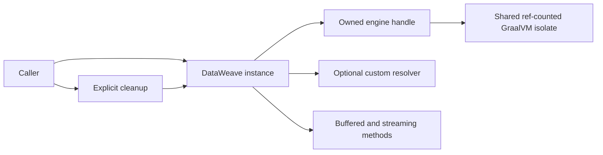

# Explicit-Instance-Only Python and Node Bindings Design

**Date:** 2026-09-15
**Status:** Approved for planning
**Scope:** `native-lib` Python and Node public APIs, repository-owned consumers, tests, benchmarks, examples, and documentation
**Related:** [Multiple Isolated DataWeave Engines per Process](./2026-08-07-native-lib-multi-engine-design.md)

## 1. Goal

Make caller-owned `DataWeave` objects the only way to execute DataWeave through
the Python and Node bindings. Remove the module-level convenience functions,
their hidden singleton engines, and their automatic process/interpreter cleanup
hooks.

This is an intentional breaking API change. It makes engine configuration,
lifecycle, resolver ownership, and cleanup visible at every call site while
preserving all buffered and streaming capabilities on explicit instances.

## 2. Motivation

The native layer already supports multiple independent engine objects inside one
shared GraalVM isolate. Each Python or Node `DataWeave` instance owns one engine
handle and may own a distinct custom module resolver. The module-level APIs sit
above that model and reintroduce one hidden process-wide engine:

- Python lazily creates `_global_instance`, serializes access with
  `_global_lock`, registers `atexit` cleanup, and forwards six public functions
  to the hidden instance.
- Node lazily creates `globalInstance`, registers `beforeExit` and `exit`
  listeners, and coordinates singleton generations and asynchronous cleanup.

That hidden ownership creates a second lifecycle model that callers must learn,
cannot be configured with a resolver, and requires substantial concurrency and
shutdown machinery unrelated to explicit engine operation. Removing it leaves
one model in both bindings: create, initialize, use, and clean up the instance
that owns the engine.

## 3. Public API

### 3.1 Python

Remove these package-level callables from `dataweave`:

```python
run
run_streaming
run_transform
run_callback
run_input_output_callback
cleanup
```

They are removed from the module namespace and from `dataweave.__all__`. There
are no deprecated aliases, compatibility shims, warning stubs, or temporary
instances created behind these names.

The package continues to export:

```python
DataWeave
DataWeaveError
DataWeaveLibraryNotFoundError
DataWeaveScriptError
ExecutionResult
InputValue
ReadCallback
Stream
StreamingResult
WriteCallback
READ_CALLBACK
RESOLVE_MODULE_CALLBACK
WRITE_CALLBACK
ModuleResolver
compose_resolvers
modules_from_directory
modules_from_jars
modules_from_map
```

Execution uses a caller-owned context manager when the lifetime is lexical:

```python
from dataweave import DataWeave

with DataWeave() as dw:
    result = dw.run("2 + 2")
```

Longer-lived applications may initialize and clean up explicitly:

```python
dw = DataWeave(resolve_module=resolver)
dw.initialize()
try:
    result = dw.run(script, inputs)
finally:
    dw.cleanup()
```

`DataWeave` retains `run`, `run_streaming`, `run_transform`, `run_callback`, and
`run_input_output_callback` with their existing signatures and behavior.

### 3.2 Node

Remove these package-level exports from `dataweave-native` and from the internal
`dataweave.ts` module:

```typescript
run
runStreaming
runTransform
cleanup
```

There are no deprecated aliases, compatibility shims, warning stubs, or
temporary instances. `src/index.ts` continues to export `DataWeave`,
`DataWeaveOptions`, result/input types, error classes, and resolver utilities.

Execution uses an explicitly initialized instance with awaited cleanup:

```typescript
import { DataWeave } from "dataweave-native";

const dw = new DataWeave();
dw.initialize();
try {
  const result = dw.run("2 + 2");
} finally {
  await dw.cleanup();
}
```

`DataWeave` retains `run`, `runStreaming`, and `runTransform` with their existing
signatures and behavior. Node does not gain an automatic-disposal protocol or a
new helper in this change.

## 4. Lifecycle Model

After this change, both bindings expose one lifecycle:

1. The caller constructs a `DataWeave` object, optionally with a native library
   path and custom resolver.
2. The caller initializes that object before execution.
3. All buffered or streaming work is submitted through that object.
4. The caller deterministically cleans up that same object.



No Python `atexit` callback and no Node `beforeExit` or `exit` listener is
registered by the high-level binding. Explicit cleanup is the documented
contract. Existing lower-level owner-death safeguards remain a last-resort
resource-safety mechanism for abnormal termination; they are not promoted as a
substitute for deterministic cleanup.

Removing module-level ownership does not alter:

- per-instance engine handles and script caches;
- shared-isolate reference counting;
- resolver registration and isolation;
- active-stream admission, cancellation, backpressure, and cleanup;
- stale engine-generation checks;
- cleanup retry behavior on an explicit instance; or
- native owner-env/owner-thread death handling.

The uncommitted review-22 changes that harden explicit `DataWeave` lifecycle or
native cleanup remain applicable. Changes whose only purpose is tracking,
bounding, retrying, or automatically cleaning module singleton generations are
superseded and must be removed with the singleton.

## 5. Streaming and Resolver Behavior

Explicit instances continue to expose all currently supported execution modes:

| Binding | Buffered | Output streaming | Input/output streaming | Callback streaming |
| --- | --- | --- | --- | --- |
| Python | `dw.run` | `dw.run_streaming` | `dw.run_transform` | `dw.run_callback`, `dw.run_input_output_callback` |
| Node | `dw.run` | `dw.runStreaming` | `dw.runTransform` | Internal native callback bridge only |

Custom resolvers remain configured on the instance constructor. Buffered
execution resolves custom modules independently per engine.

The existing streaming limitation remains unchanged: a resolver-backed engine
cannot invoke a Python or JavaScript resolver from the native background thread.
A streamed or transformed script that imports a custom module therefore fails
closed as documented. Removing the singleton neither causes nor fixes this
N-API/ctypes callback-thread constraint.

## 6. Repository Consumer Migration

Every repository-owned caller of a removed function must move to an explicit
instance. This includes production examples, Python and Node tests, benchmark
runners, benchmark test doubles, README snippets, and architecture documents.

Use the narrowest deterministic lifetime suitable for each caller:

- Examples use a context manager in Python and `try/finally` in Node.
- A test file or fixture that intentionally reuses an initialized engine owns a
  fixture-scoped instance and cleans it at fixture teardown.
- Tests that verify independent engines construct and clean each instance they
  exercise.
- Warm benchmark runners initialize one instance outside the measured loop and
  reuse it for all warm and streaming samples.
- Cold-start child processes continue to create one instance, initialize it,
  perform the measured first run, and clean it before exit.
- Wrapper loaders validate the `DataWeave` constructor export rather than a
  module-level `run` function.

Migration must not initialize a fresh engine for every warm sample, hide a new
singleton in a benchmark wrapper or fixture, or rely on process termination for
normal cleanup.

Historical design documents may retain old function names when describing an
implemented benchmark method or an instance method. Statements that define the
current public lifecycle or promise an available module-level API must be
updated. The consolidated multi-engine design becomes explicit that the public
Python API changed and neither binding retains a high-level singleton.

## 7. Tests

### 7.1 Public surface

Python facade tests assert that all six removed names are absent from both
`dataweave.__all__` and the module namespace. They continue to assert the exact
remaining model, callback, error, resolver, and `DataWeave` exports.

Node tests import the package entry point and assert that `DataWeave` remains
exported while `run`, `runStreaming`, `runTransform`, and `cleanup` are absent.
The strict TypeScript build also proves repository TypeScript callers no longer
import removed symbols.

Tests devoted only to singleton first use, singleton recreation, singleton
generation queues, automatic exit listeners, or module-level cleanup are
deleted. They are not translated into instance tests unless they cover an
instance-level contract that otherwise lacks coverage.

### 7.2 Existing behavior

Buffered, streaming, callback, resolver, lifecycle, cleanup retry, independent
engine, worker-thread, and TCK tests run through explicit instances. Native
integration coverage continues to verify that multiple instances share the
isolate safely while owning separate engines.

### 7.3 Consumer and documentation gate

A repository search must find no executable or current-API documentation use of
the removed package-level names. Search results that are valid historical prose
or instance-method references are reviewed manually rather than changed
mechanically.

The final verification sequence is:

```bash
./gradlew native-lib:test -PskipNodeTests=true -PskipPythonTests=true
cd native-lib/python && python3 -m pytest tests/unit
cd native-lib/node && npm run build:ts
cd native-lib/node && npm run test:unit
cd benchmarks && node --test lib/stats.test.mjs runners/node/*.test.mjs
cd benchmarks/runners/python && python3 -m unittest test_bench
./gradlew native-lib:nativeCompile
./gradlew native-lib:pythonTest
cd native-lib/node && npm run test:integration
```

Run Node TCK after staging its corpus when available. Native-image and binding
integration commands require GraalVM Community Java 24 and the repository's
documented native toolchain.

## 8. Documentation

Update `native-lib/README.md`, `native-lib/python/README.md`, and
`native-lib/node/README.md` so the first runnable example demonstrates explicit
ownership. Each binding documents initialization, deterministic cleanup,
instance reuse, resolver configuration, and streaming through instance methods.

Update examples and benchmark guidance to use the same lifecycle. Remove text
about lazy singleton initialization, module cleanup, singleton recreation,
generation bounds, and automatic shutdown hooks. Preserve warnings about active
streams, asynchronous Node cleanup, callback safety, and custom-resolver
streaming limitations.

## 9. Compatibility and Release Impact

This change breaks source compatibility for clients importing or calling the
removed convenience functions. Failure is immediate and visible:

- Python attribute access or imports of removed names fail.
- Node named imports fail TypeScript compilation or evaluate as absent exports
  in JavaScript.

There is no runtime deprecation period. Release notes must identify the removed
symbols and show the explicit-instance replacement pattern for each language.
The native C ABI, result envelope, wire fields, and package names do not change.

## 10. Alternatives Rejected

**Keep deprecated wrappers.** Rejected because the hidden singleton, automatic
hooks, and lifecycle concurrency machinery would remain indefinitely despite
the preferred API changing.

**Construct a temporary instance per module-level call.** Rejected because it
makes streaming ownership ambiguous, makes cleanup timing dependent on generator
consumption, and adds initialization/teardown overhead to every buffered call.

**Keep execution helpers but remove module cleanup.** Rejected because it leaves
a hidden native engine with no deterministic owner.

**Introduce a new configurable global runtime.** Rejected because resolver and
lifecycle configuration would still be process-global and would duplicate the
already-supported explicit-instance model.

## 11. Acceptance Criteria

- Python exposes no module-level execution or cleanup callable.
- Node exports no module-level execution or cleanup function.
- `DataWeave` instance methods retain their existing signatures and execution
  behavior in both bindings.
- No high-level binding registers automatic process/interpreter cleanup hooks.
- Every repository-owned executable caller uses and deterministically cleans an
  explicit instance.
- Warm benchmarks reuse one initialized instance outside measured loops.
- Public-surface tests prove removed symbols are absent.
- Singleton-only implementation and tests are deleted.
- Current API documentation contains no singleton guidance or removed helper
  examples.
- Existing resolver, streaming, lifecycle, native integration, and benchmark
  tests pass, subject to documented native-toolchain availability.
